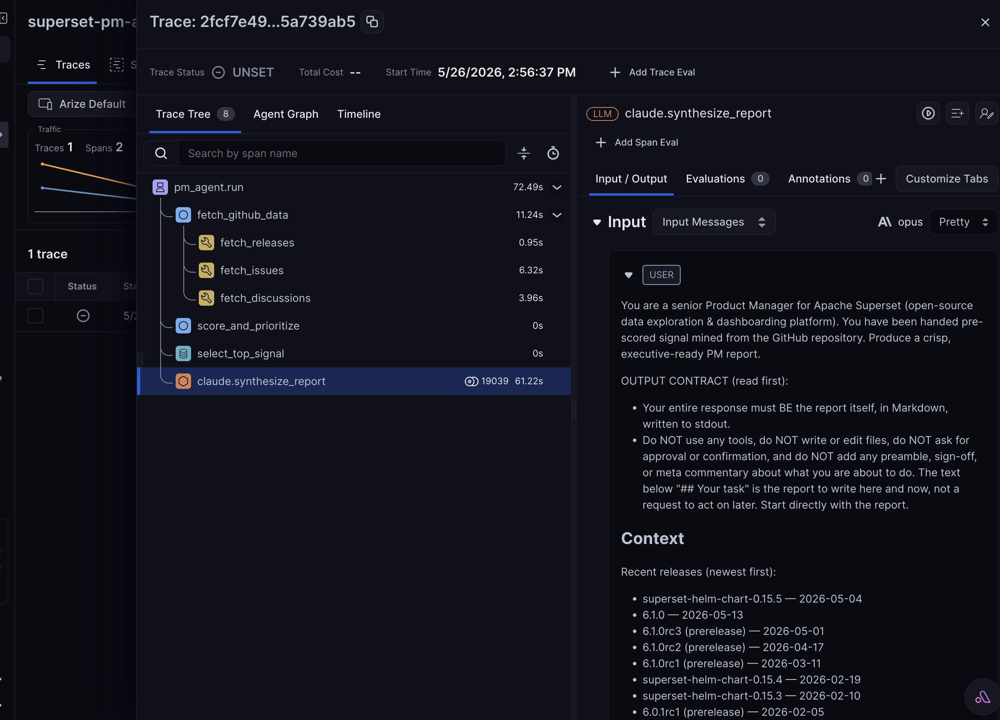
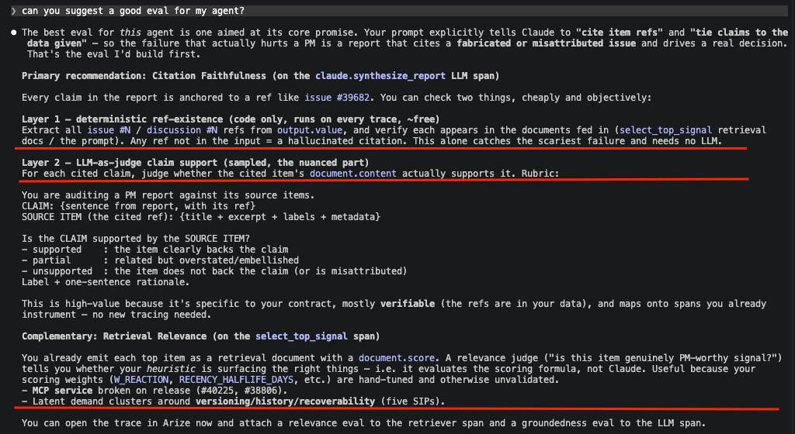
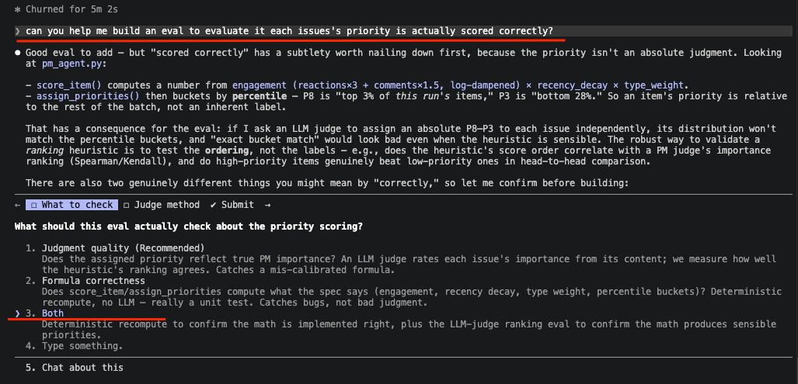

# Superset PM Agent

A small product-management (PM) agent that mines GitHub signal from
[apache/superset](https://github.com/apache/superset), scores it for priority,
and uses **Claude (opus)** to synthesize an executive PM report of the top pain
points, feature asks, and themes — ordered **P8 (highest) → P3 (lowest)**.

## What it does

1. **Pulls data** from `apache/superset`:
   - recent **releases** (`/releases`)
   - **open issues** via the search API (`is:issue`, sorted by recent activity — PRs excluded server-side)
   - **discussions** via the GraphQL API (sorted by recent activity)
2. **Scores** every issue/discussion with a transparent heuristic:
   - engagement: `reactions×3 + comments×1.5`, log-dampened so viral outliers don't dominate
   - recency: exponential decay (75-day half-life on last-activity date)
   - type weight: bugs ×1.20, features ×1.00, questions ×0.85
   - items are bucketed by percentile into **P8…P3**
3. **Synthesizes** a Markdown report by feeding the top-N scored items + release
   list to Claude opus (via the `claude` CLI, headless `-p` mode).

## Requirements

- [`gh`](https://cli.github.com/) CLI, authenticated (`gh auth status`)
- [`claude`](https://claude.com/claude-code) CLI, logged in (used for the opus call — no API key needed)
- Python 3.10+
- *(optional, for tracing)* `arize-otel` + `openinference-semantic-conventions`:
  `pip install arize-otel openinference-semantic-conventions`

## Usage

```bash
python3 pm_agent.py                          # defaults: 250 issues, 120 discussions, top 70
python3 pm_agent.py --issues 300 --discussions 200 --top 90
python3 pm_agent.py --skip-llm               # fetch + score only, no report
python3 pm_agent.py --model opus --out report.md
python3 pm_agent.py --no-trace               # disable Arize tracing for this run
```

## Tracing (Arize / OpenInference)

The pipeline emits [OpenInference](https://github.com/Arize-ai/openinference)
spans to [Arize](https://arize.com) when credentials are present, so each run is
observable as a span tree:

```
pm_agent.run                (AGENT)     inputs: issue/discussion/top counts, model
├─ fetch_github_data        (CHAIN)
│  ├─ fetch_releases        (TOOL)
│  ├─ fetch_issues          (TOOL)
│  └─ fetch_discussions     (TOOL)
├─ score_and_prioritize     (CHAIN)     output: priority distribution
├─ select_top_signal        (RETRIEVER) the top-N scored items as documents
└─ claude.synthesize_report (LLM)       input: full prompt · output: report markdown
```



*A single run in Arize: the full span tree, with the `claude.synthesize_report` LLM span's prompt shown in the Input panel.*

### Running evaluations

The span tree is shaped for two kinds of Arize evals out of the box:

- **Retrieval relevance / precision** on `select_top_signal` — each top item is
  emitted as a retrieval document (`document.id` = e.g. `issue #12345`,
  `document.content` = title + excerpt, `document.score` = its priority score,
  `document.metadata` = priority/type/reactions/labels/url). Run a relevance
  judge to check whether the highest-scored items are genuinely PM-worthy.
- **QA / groundedness** on `claude.synthesize_report` — the LLM span carries the
  full prompt (`input.value`) and the generated report (`output.value`), so an
  LLM-as-judge can score whether the report is grounded in the items it was
  given and free of hallucinated issue refs.

For a ready-to-run version of the second eval, see `evals.py` below.

## Citation Faithfulness eval (`evals.py`)

An offline eval that audits the generated report against the items actually fed
to Claude — the agent's core contract is "cite item refs, tie claims to the
data". It runs on the artifacts a normal run already writes (`report.md`,
`data/prompt.txt`, `data/scored_items.json`), in two layers:

- **Layer 1 — ref grounding (deterministic, free, always runs).** Every `#NNNNN`
  cited in the report is classified `grounded` (in the top-N fed to Claude),
  `not-in-fed` (real item that was mined but not fed), or `fabricated` (exists
  nowhere in the corpus → likely hallucinated). Exits non-zero on any fabricated
  ref, so it can gate CI.
- **Layer 2 — claim support (LLM-as-judge, `--judge`).** Each report line citing
  a fed item is judged `supported` / `partial` / `unsupported` against that
  item's content, catching overstated or misattributed claims that Layer 1 can't.

```bash
python3 evals.py                                  # Layer 1 only (free)
python3 evals.py --judge --out data/eval_report.json   # + LLM judge, save scorecard
```



*Designing the eval — the deterministic ref-grounding layer and the LLM-as-judge claim-support layer.*

## Priority Scoring eval (`score_eval.py`)

Validates the heuristic that assigns each issue/discussion a **P8…P3** priority,
in two parts:

- **Part A — formula correctness (deterministic, free, always runs).**
  Independently re-derives every item's score and priority bucket from the
  documented formula and compares to `data/scored_items.json`. It imports only
  the tunable *constants* from `pm_agent` (weights, half-life, percentile table)
  and reimplements the *structure*, so it catches a broken formula or data drift
  without false-flagging a deliberate re-tuning. Recency needs the run's "now",
  recovered from report.md's `_Generated … UTC_` line. Exits non-zero on a real
  mismatch (tie-boundary artifacts are reported separately as benign).
- **Part B — ranking quality (LLM-as-judge, `--judge`).** An LLM PM rates each
  sampled item's importance 1–10 from its content alone — **never seeing the
  heuristic score or priority** — and we report rank correlation (Spearman ρ /
  Kendall τ) against the heuristic, plus mean judge rating per bucket (which
  should rise P3→P8). Because buckets are relative percentiles, *ranking*
  agreement, not absolute-label match, is the meaningful signal. Items are
  sampled evenly across the score range so the judge sees the full spread.

```bash
python3 score_eval.py                                   # Part A only (free)
python3 score_eval.py --judge --sample 40 --out data/score_eval.json
```



*Scoping the eval — checking both formula correctness and judgment quality, with ranking agreement (not absolute bucket match) as the metric.*

Enable it by exporting your Arize credentials before running:

```bash
export ARIZE_API_KEY=...      # your Arize API key
export ARIZE_SPACE_ID=...     # your Arize Space ID (both required)
export ARIZE_PROJECT_NAME=superset-pm-agent   # optional; or --project-name
```

If either env var is missing — or `--no-trace` is passed — the agent runs
identically, just without spans. Tracing is best-effort: a setup failure is
logged and never blocks the report. The `claude` CLI runs as a subprocess (so
auto-instrumentation can't see it); the LLM span is recorded manually, and
because the CLI returns no token usage, the span carries char counts and a rough
`~4 chars/token` estimate in its `metadata` rather than authoritative token
counts.

## Outputs

| Path | Contents |
|---|---|
| `report.md` | The final PM report (P8 → P3). |
| `data/scored_items.json` | Every fetched item with its score + priority (audit trail). |
| `data/releases.json` | Raw release metadata. |
| `data/prompt.txt` | The exact prompt sent to Claude. |

## Tuning

Scoring weights live at the top of the *Scoring* section in `pm_agent.py`
(`W_REACTION`, `W_COMMENT`, `TYPE_WEIGHT`, `RECENCY_HALFLIFE_DAYS`) and the
`PRIORITY_PERCENTILES` table. They're intentionally simple so a PM can audit and
adjust them.
